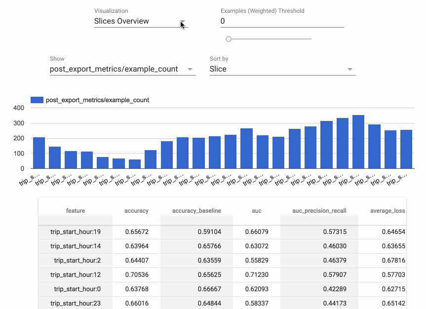

<!-- See: www.tensorflow.org/tfx/model_analysis/ -->

# TensorFlow Model Analysis

*TensorFlow Model Analysis* (TFMA) is a library for evaluating TensorFlow models.
It allows users to evaluate their models on large amounts of data in a
distributed manner, using the same metrics defined in their trainer. These
metrics can be computed over different slices of data and visualized in Jupyter
notebooks.

Caution: TFMA may introduce backwards incompatible changes before version 1.0.

## Installation

The recommended way to install TFMA is using the
[PyPI package](https://pypi.org/project/tensorflow-model-analysis/):

<pre class="devsite-terminal devsite-click-to-copy">
pip install tensorflow-model-analysis
</pre>

Currently, TFMA requires that TensorFlow is installed but does not have an
explicit dependency on the TensorFlow PyPI package. See the
[TensorFlow install guides](/install) for instructions.

To enable TFMA visualization in Jupyter Notebook:

<pre class="prettyprint">
  <code class="devsite-terminal">jupyter nbextension enable --py widgetsnbextension</code>
  <code class="devsite-terminal">jupyter nbextension install --py --symlink tensorflow_model_analysis</code>
  <code class="devsite-terminal">jupyter nbextension enable --py tensorflow_model_analysis</code>
</pre>

Note: If Jupyter notebook is already installed in your home directory, add
`--user` to these commands. If Jupyter is installed as root, or using a virtual
environment, the parameter `--sys-prefix` might be required.

### Dependencies

[Apache Beam](https://beam.apache.org/) is required to run distributed analysis.
By default, Apache Beam runs in local mode but can also run in distributed mode
using [Google Cloud Dataflow](https://cloud.google.com/dataflow/). TFMA is
designed to be extensible for other Apache Beam runners.

## Getting Started

For instructions on using TFMA, see the [get started
guide](g3doc/get_started.md) and try out the extensive [end-to-end example](examples/chicago_taxi/README.md).

## Compatible Versions

The following table is the TFMA package versions that are compatible with each
other. This is determined by our testing framework, but other *untested*
combinations may also work.

|tensorflow-model-analysis  |tensorflow    |apache-beam[gcp]|
|---------------------------|--------------|----------------|
|GitHub master              |1.9           |2.6.0           |
|0.9.1                      |1.9           |2.6.0           |
|0.9.0                      |1.9           |2.5.0           |
|0.6.0                      |1.6           |2.4.0           |

## Questions

Please direct any questions about working with TFMA to
[Stack Overflow](https://stackoverflow.com) using the
[tensorflow-model-analysis](https://stackoverflow.com/questions/tagged/tensorflow-model-analysis)
tag.
