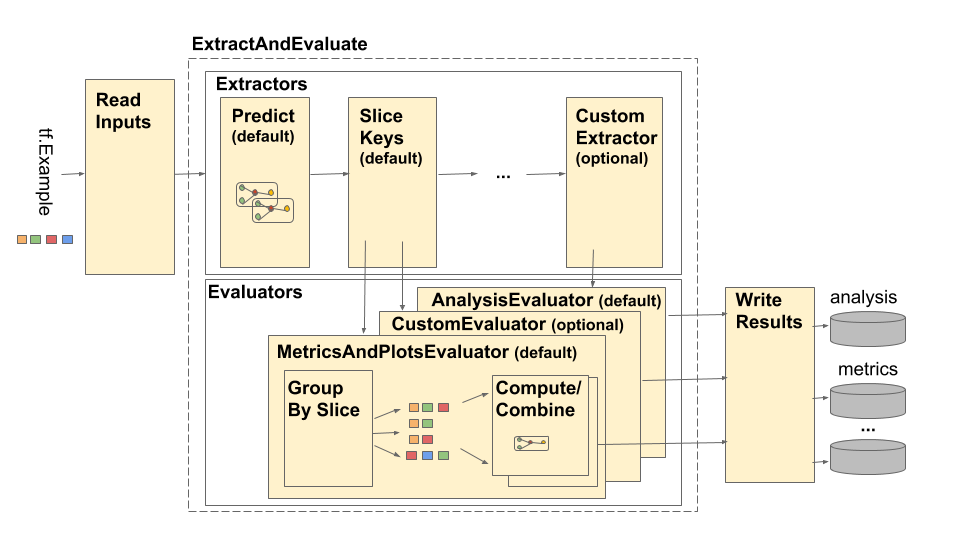

# Tensorflow Model Analysis Architecture

## Overview

The TensorFlow Model Analysis (TFMA) pipeline is depicted as follows:



The pipeline is made up of four main components:

  * Read Inputs
  * Extraction
  * Evaluation
  * Write Results

These components make use of two primary types: `tfma.Extracts` and
`tfma.evaluators.Evaluation`. The type `tfma.Extracts` represents data that is
extracted during pipeline processing whereas the type
`tfma.evaluators.Evaluation` represents the output from evaluating the extracts
at various points during the process of extraction. In order to provide a
flexible API, these types are just dicts where the keys are defined (reserved
for use) by different implementations. The types are defined as follows:

```python
# Extracts represent data extracted during pipeline processing.
# For example, the PredictExtractor stores the data for the
# features, labels, and predictions under the keys "features",
# "labels", and "predictions".
Extracts = Dict[Text, Any]

# Evaluation represents the output from evaluating extracts at
# particular point in the pipeline. The evaluation outputs are
# keyed by their associated output type. For example, the metric / plot
# dictionaries from evaluating metrics and plots will be stored under
# "metrics" and "plots" respectively.
Evaluation = Dict[Text, beam.pvalue.PCollection]
```

Note that `tfma.Extracts` are never written out directly they must always go
through an evaluator to produce a `tfma.evaluators.Evaluation` that is then
written out. Also note that `tfma.Extracts` are dicts that are stored in a
`beam.pvalue.PCollection` (i.e. `beam.PTransform`s take as input
`beam.pvalue.PCollection[tfma.Extracts]`) whereas a `tfma.evaluators.Evaluation`
is a dict whose values are `beam.pvalue.PCollection`s (i.e. `beam.PTransform`s
take the dict itself as the argument for the `beam.value.PCollection` input). In
other words the `tfma.evaluators.Evaluation` is used at pipeline construction
time, but the `tfma.Extracts` are used at pipeline runtime.

## Read Inputs

The `ReadInputs` stage is made up of a transform that takes raw inputs
(tf.train.Example, CSV, ...) and converts them into extracts. Today the extracts
are represented as raw input bytes stored under `tfma.INPUT_KEY`, however the
extracts can be in any form that is compatible with the extraction pipeline --
meaning that it creates `tfma.Extracts` as output, and that those extracts are
compatible with downstream extractors. It is up to the different extractors to
clearly document what they require.

## Extraction

The extraction process is a list of `beam.PTransform`s that are run in series.
The extractors take `tfma.Extracts` as input and return `tfma.Extracts` as
output. The proto-typical extractor is the `tfma.extractors.PredictExtractor`
which uses the input extract produced by the read inputs transform and runs it
through a model to produce features, labels, and predictions extracts.
Customized extractors can be inserted at any point provided their transforms
conform to the `tfma.Extracts` in and `tfma.Extracts` out API. An extractor is
defined as follows:

```python
# An Extractor is a PTransform that takes Extracts as input and returns
# Extracts as output. A typical example is a PredictExtractor that receives
# an 'input' placeholder for input and adds additional 'features', 'labels',
# and 'predictions' extracts.
Extractor = NamedTuple('Extractor', [
    ('stage_name', Text),
    ('ptransform', beam.PTransform)])  # Extracts -> Extracts
```

Note that outside of very special cases, it is almost always the case that one
`tfma.Extracts` in a `beam.pvalue.PCollection` will correspond to one example
from the model.

## Evaluation

Evaluation is the process of taking an extract and evaluating it. A common
example is the `tfma.evaluators.MetricsAndPlotsEvaluator` which takes features,
labels, and predictions as input, and then evaluates those inputs to produce
metrics and plots data as output. While it is common to perform evaluation at
the end of the extraction pipeline, there are use-cases that require evaluation
earlier in the extraction process. As such evaluators are associated with the
extractors whose output they should be evaluated against. An evaluator is
defined as follows:

```python
# An evaluator is a PTransform that takes Extracts as input and
# produces an Evaluation as output. A typical example of an evaluator
# is the MetricsAndPlotsEvaluator that takes the 'features', 'labels',
# and 'predictions' extracts from the PredictExtractor and evaluates
# them using post export metrics to produce metrics and plots dictionaries.
Evaluator = NamedTuple('Evaluator', [
  ('stage_name', Text),
  ('run_after', Text),              # Extractor.stage_name
  ('ptransform', beam.PTransform)]) # Extracts -> Evaluation
```

Notice that an evaluator is a `beam.PTransform` that takes `tfma.Extracts` as
inputs. There is nothing stopping an implementation from performing additional
transformations on the extracts as part of the evaluation process. This is
exactly what the `tfma.evaluators.MetricsAndPlotsEvaluator` does. It takes the
incoming features, labels, and predictions and runs them through
`tfma.slicer.FanoutSlices` to group them by slices prior to performing the
actual metrics and plots evaluation.

Also note that an evaluator can produce any output it wants. In the case of the
`tfma.evaluators.MetricsAndPlotsEvaluator` the output is in the form of metrics
and plots dictionaries (these are later converted to serialized protos for
output by `tfma.writers.MetricsAndPlotsWriter`)

## Write Results

The `WriteResults` stage is where the evaluation output gets written out to
disk. WriteResults uses writers to write out the data based on the output keys.
For example, an `tfma.evaluators.Evaluation` may contain keys for 'metrics' and
'plots'. These would then be associated with the metrics and plots dictionaries
called 'metrics' and 'plots'. The writers specify how to write out each file:

```python
# A writer is a PTransform that takes evaluation output as input and
# serializes the associated PCollections of data to a sink.
Writer = NamedTuple('Writer', [
  ('stage_name', Text),
  ('ptransform', beam.PTransform)])    # Evaluation -> PDone
```

We provide a `tfma.writers.MetricsAndPlotsWriter` that converts the metrics and
plots dictionaries to serialized protos and writes them to disk.

If you wish to use a different serialization format, you can create a custom
writer and use that instead. Since the `tfma.evaluators.Evaluation` passed to
the writers contains the output for all of the evaluators combined, a
`tfma.writers.Write` helper transform is provided that writers can use in their
`ptransform` implementations to select the appropriate `beam.PCollection`s based
on an output key (see below for an example).

# Customization

The `tfma.run_model_analysis` method takes `extractors`, `evaluators`, and
`writers` arguments for customing the extractors, evaluators, and writers used
by the pipeline. If no arguments are provided then `tfma.default_extractors`,
`tfma.default_evaluators`, and `tfma.default_writers` are used by default.

## Custom Extractors

To create a custom extractor, create a `tfma.extractors.Extractor` type that
wraps a `beam.PTransform` taking `tfma.Extracts` as input and returning
`tfma.Extracts` as output. Examples of extractors are available under
`tfma.extractors`.

## Custom Evaluators

To create a custom evaluator, create a `tfma.evaluators.Evaluator` type that
wraps a `beam.PTransform` taking `tfma.Extracts` as input and returning
`tfma.evaluators.Evaluation` as output. A very basic evaluator might just take
the incoming `tfma.Extracts` and output them for storing in a table. This is
exactly what the `tfma.evaluators.AnalysisTableEvaluator` does. A more
complicated evaluator might perform additional processing and data aggregation.
See the `tfma.evaluators.MetricsAndPlotsEvaluator` as an example..

Note that the `tfma.evaluators.MetricsAndPlotsEvaluator` itself can be
customized to support custom metrics (see `tfma.post_export_metrics` for more
details).

## Custom Writers

To create a custom writer, create a `tfma.writers.Writer` type that wraps a
`beam.PTransform` taking `tfma.evaluators.Evaluation` as input and returning
`beam.pvalue.PDone` as output. The following is a basic example of a writer for
writing out TFRecords containing metrics:

```python
tfma.writers.Writer(
  stage_name='WriteTFRecord(%s)' % tfma.METRICS_KEY,
  ptransform=tfma.writers.Write(
    key=tfma.METRICS_KEY,
    ptransform=beam.io.WriteToTFRecord(file_path_prefix=output_file))
```

A writer's inputs depend on the output of the associated evaluator. For the
above example, the output is a serialized proto produced by the
`tfma.evaluators.MetricsAndPlotsEvaluator`. A writer for the
`tfma.evaluators.AnalysisTableEvaluator` would be responsible for writing out a
`beam.pvalue.PCollection` of `tfma.Extracts`.

Note that a writer is associated with the output of an evaluator via the output
key used (e.g. `tfma.METRICS_KEY`, `tfma.ANALYSIS_KEY`, etc).

# Step by Step Example

The following is an example of the steps involved in the extraction and
evaluation pipeline when both the `tfma.evaulators.MetricsAndPlotsEvaluator` and
`tfma.evaluators.AnalysisTableEvaluator` are used:

```python
run_model_analysis(
    ...
    extractors=[
        tfma.extractors.PredictExtractor(...),
        tfma.extractors.SliceKeyExtrator(...)
    ],
    evaluators=[
        tfma.evaluators.MetricsAndPlotsEvaluator(...),
        tfma.evaluators.AnalysisTableEvaluator(...)
    ])
```

`ReadInputs`

```python
# Out
Extracts {
  'input': bytes                 # CSV, Proto, ...
}
```

`ExtractAndEvaluate`

* `tfma.extractors.PredictExtractor`

```python
# In:  ReadInputs Extracts
# Out:
Extracts {
  'input': bytes                    # CSV, Proto, ...
  'features': tensor_like           # Raw features
  'labels': tensor_like             # Labels
  'predictions': tensor_like        # Predictions
}
```

* `tfma.extractors.SliceKeyExtractor`

```python
# In: PredictExtractor Extracts
# Out:
Extracts {
  'features': tensor_like           # Raw features
  'labels': tensor_like             # Labels
  'predictions': tensor_like        # Predictions
  'slice_key': Tuple[bytes...]      # Slice
}
```

* `tfma.evaluators.MetricsAndPlotsEvaluator` (run_after: `SLICE_KEY_EXTRACTOR_STAGE_NAME`)

```python
# In: SliceKeyExtractor Extracts
# Out:
Evaluation {
  'metrics': PCollection[Tuple[slicer.SliceKeyType, Dict[Text, Any]]]  # Tuples of (slice key, dictionary from metric key to metric values)
  'plots': PCollection[Tuple[slicer.SliceKeyType, Dict[Text, Any]]]  # Tuples of (slice key, dictionary from plot key to plot values)
}
```

* `tfma.evaluators.AnalysisTableEvaluator` (run_after: `LAST_EXTRACTOR_STAGE_NAME`)

```python
# In: SliceKeyExtractor Extracts
# Out:
Evaluation {
  'analysis': PCollection[Extracts] # Final Extracts
}
```

`WriteResults`

```python
# In:
Evaluation {
  'metrics': PCollection[Tuple[slicer.SliceKeyType, Dict[Text, Any]]]  # Tuples of (slice key, dictionary from metric key to metric values)
  'plots': PCollection[Tuple[slicer.SliceKeyType, Dict[Text, Any]]]  # Tuples of (slice key, dictionary from plot key to plot values)
  'analysis': PCollection[Extracts] # Final Extracts
}
# Out: metrics, plots, and analysis files
```
